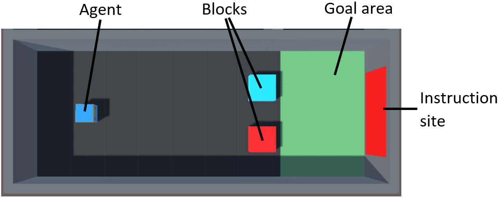
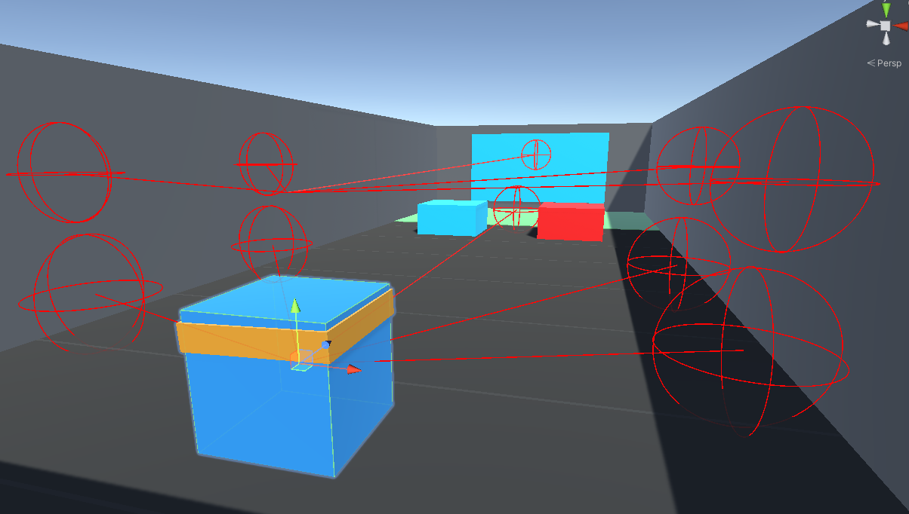

# From Single-Agent Reinforcement Learning to Multi-Agent Communication

## Overview
This repository contains the code for a deep reinforcement learning project that uses the 
[ML-Agents toolkit](https://unity.com/de/products/machine-learning-agents) provided by 
Unity. The original project goal was to investigate the development of multi-agent communication when two agents would be
provided with split observation and action spaces that only combined allow to solve a given task.

This repository contains the groundwork for this project: The environment, developed in Unity, contains the single-agent
setup in which only one agent is present and receives all necessary information to solve the task. This setup was chosen
as a proof of concept, that the task was solvable in itself.

For more information on the project, please refer to the 
[project report](https://github.com/jlinkemeyer/DRL-MultiAgent/blob/ddqn/report.pdf), 
or the [summary video](https://myshare.uni-osnabrueck.de/f/dd7cae5bdd534c8ba75a/).

## Repository Structure
  
    ├── builds                    # Unity builds (training uses a unity executable, build is for windows)
    ├── DRL-Unity                 # the entire Unity project
    ├── logs                      # Unity log folder (provides information in case of crashs)
    ├── plots                     # depending on the configurations, plots are stored to show the training process (plots for mean reward sum, scores (correct/ false goals), loss over time, and if used: batch size increase, or learning rate decrease plots)
    ├── tf_checkpoints            # folder from which checkpoint is loaded (if exists)
    ├── DQN_agent.py              # Deep Q-Network agent
    ├── DDQN_agent.py             # Double deep Q-Learning agent, inherits from DQN agent with slightly modified learning function
    ├── memory.py                 # experience replay buffer used for training
    ├── model.py                  # a simple neural network
    ├── main.py                   # main training and testing functionalities  
    ├── requirements.txt          # required environment installs
    └── README.md

## Environment
The environment was built in Unity using the [ML-Agents toolkit](https://unity.com/de/products/machine-learning-agents).
The agent has the task to learn to push one out of two differently-colored blocks into a goal area. The agent has to 
determine which of the two blocks it is supposed to push into the goal area based on an instruction. The instruction is
provided via a gameobject that takes the color of the block the agent is supposed to score with.

  <figure>
    
  </figure>

The agent perceives its environment using raycast observations. This allows the agent to 'see' but still keep the 
observation space relatively small. To learn more on raycast observations, please refer to 
[this site](https://github.com/Unity-Technologies/ml-agents/blob/main/docs/Learning-Environment-Design-Agents.md#raycast-observations). 
To get a first
idea on what raycasts are, please see the image below. The agent is able to perceive everything that is 'hit' by a ray.

  <figure>
    
  </figure>

## How to use
If you would like to run the code yourself, please follow the instructions below:

### Create a conda environment 
* Make sure you have anaconda or miniconda installed
* Open the console
* Create a new conda environment with python version 3.10 using the following command (please adapt NAME to your preferred environment name)
  * `conda create --name NAME python=3.10`
* Activate the environment using with the following command
  * `conda activate NAME`

### Clone the repository
* Go to the directory (PATH) you would like this repo to be cloned in
  * `cd PATH`
* Run the following commands:
  * `git clone https://github.com/jlinkemeyer/DRL-MultiAgent.git`
  * `cd DRL-MultiAgent`
  * `pip3 install -r requirements.txt`

### Testing

#### Download the checkpoints
If you do not want to train the network yourself but still want to see how the trained agent behaves in its environment,
please download the checkpoints from [here](https://myshare.uni-osnabrueck.de/f/f81d6193843045d49202/) and unzip them 
into the `tf_checkpoints` folder.

#### Start testing
Now you can simply run the command `python main.py --train False`. A Unity window will open up and show how the agent 
performs using the loaded checkpoints.

### Training yourself
Checkpoints are loaded automatically if they are contained in the checkpoints folder. If you want to train from scratch,
make sure that the checkpoints folder is empty. Then, simply run the command `python main.py`

**Options:** You have different options on how you would like to train. You can set different flags when calling 
`python main.py`. You have the option to use `--incr_batch True` to use code that increases batch size during training.
You can also use a learning rate decrease during training by passing the flag `--decr_lr True`.

